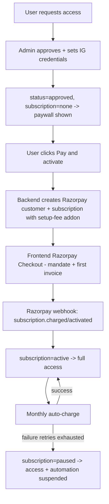

## Razorpay Monthly Subscription Integration

### Decisions (confirmed)
- Recurring model: Razorpay Subscriptions with auto-debit mandate (UPI Autopay / card / eMandate).
- Setup fee: bundled into the first subscription invoice via a Razorpay `addon` (first charge = setup fee + first month; monthly thereafter).
- Pricing: global fixed via env; one Razorpay Plan created once in the dashboard.
- Access: unlocked only after a successful first payment; paused if a later monthly payment fails.

### Target flow

### Data model: subscription state
Access requires BOTH `status === 'approved'` (admin gate) AND `subscription.status` in an active set. A new `subscription` object is added parallel to the existing `status`.

- New types in [src/db/types.ts](src/db/types.ts):
  - `SubscriptionStatus = 'none' | 'created' | 'active' | 'past_due' | 'paused' | 'cancelled'`
  - `Subscription { status, razorpaySubscriptionId, razorpayCustomerId, planId, setupFeePaid, currentPeriodEnd, lastPaymentId, lastEventAt, updatedAt }`
  - Add `subscription: Subscription` to `UserDoc` and to the API-safe `User`.
- Default on user creation in [src/db/repositories/users.repo.ts](src/db/repositories/users.repo.ts) `upsertFromGoogle`: `subscription: { status: 'none', ... }`; include it in `mapUser`.
- Add repo methods: `findBySubscriptionId`, `updateSubscription(userId, patch)`, `startSubscription(userId, {razorpaySubscriptionId, customerId, planId})`.
- Add a sparse unique index on `subscription.razorpaySubscriptionId` in [src/db/index.ts](src/db/index.ts) for webhook lookups.

Access rule (mirrors current `canAutomate`): allowed when `active` or `past_due` (grace during Razorpay retries); suspended on `paused`/`cancelled`.

### Backend

1. Config — extend [src/config/env.ts](src/config/env.ts) with `RAZORPAY_KEY_ID`, `RAZORPAY_KEY_SECRET`, `RAZORPAY_WEBHOOK_SECRET`, `RAZORPAY_PLAN_ID`, `RAZORPAY_SETUP_FEE_PAISE`, `RAZORPAY_CURRENCY` (default `INR`); update `.env.example` and `getProductionConfigIssues`.
2. Add `razorpay` npm dependency (backend `package.json`).
3. New `src/services/razorpay.service.ts`:
   - `createCustomer(user)`, `createSubscription(user)` (uses `RAZORPAY_PLAN_ID` + `addons: [{ item: { name: 'Setup fee', amount: RAZORPAY_SETUP_FEE_PAISE, currency }}]`, `notes.userId`).
   - `verifyCheckoutSignature({subscriptionId, paymentId, signature})` and `verifyWebhookSignature(rawBody, header)` (HMAC-SHA256, constant-time — reuse pattern from [src/routes/webhook.routes.ts](src/routes/webhook.routes.ts)).
4. New `src/routes/billing.routes.ts` (mount `/billing` in [src/app.ts](src/app.ts) + add to `API_PREFIXES`):
   - `POST /billing/subscription` (`requireAuth`, must be `approved` + credentials configured): create/reuse Razorpay customer + subscription, persist `status:'created'`, return `{ subscriptionId, keyId }`.
   - `POST /billing/verify` (`requireAuth`): verify checkout signature for instant UX (webhooks remain source of truth).
   - `GET /billing` (`requireAuth`): return current subscription info + pricing for the paywall.
5. Razorpay webhook — add `POST /razorpay` to [src/routes/webhook.routes.ts](src/routes/webhook.routes.ts) (already under `/webhooks`, and `req.rawBody` is already captured globally in [src/app.ts](src/app.ts)). Verify signature, then map events → subscription state:
   - `subscription.activated` / `subscription.charged` -> `active` (+ `setupFeePaid`, `currentPeriodEnd`, `lastPaymentId`).
   - `subscription.pending` -> `past_due`; `subscription.halted`/`subscription.paused` -> `paused`; `subscription.cancelled`/`subscription.completed` -> `cancelled`; `subscription.resumed` -> `active`.
   - Resolve the user via `notes.userId` / `findBySubscriptionId`.
6. Access gating:
   - Extend `requireApproved` in [src/middleware/auth.ts](src/middleware/auth.ts): non-admins also need `subscription.status` in the active set (403 with a clear "payment required / paused" message otherwise).
   - Pause automation execution: in the `POST /webhooks/instagram` handler ([src/routes/webhook.routes.ts](src/routes/webhook.routes.ts)) skip `commentQueue.enqueue` when `owner.user` is a non-admin without an active subscription (`OwnerContext.user` is already available from [src/services/credentials.service.ts](src/services/credentials.service.ts)).

### Frontend (admin SPA)

1. Load Razorpay Checkout script in [admin/index.html](admin/index.html) (`https://checkout.razorpay.com/v1/checkout.js`).
2. Mirror types in [admin/src/types.ts](admin/src/types.ts) (`SubscriptionStatus`, `Subscription`, add to `User`).
3. Add API calls in [admin/src/api.ts](admin/src/api.ts): `getBilling`, `createSubscription`, `verifyPayment`.
4. New `admin/src/components/Billing.tsx` paywall: shows "Account is set up — payment pending", setup fee + monthly price, and a "Pay & activate" button that opens Razorpay Checkout with the returned `subscriptionId`/`keyId`; on success calls `verifyPayment` then refreshes the user.
5. Gate in [admin/src/App.tsx](admin/src/App.tsx): change `canAutomate` to also require an active subscription; in the main render (currently line ~309) show `Billing` when `status === 'approved'` but subscription not active. `RequestAutomation` continues to handle `none`/`pending`/`rejected`.
6. Replace the static "InstaPilot Pro / Active" card in [admin/src/components/Dashboard.tsx](admin/src/components/Dashboard.tsx) (~lines 414-477) with real subscription state: active/past_due/paused badge, next charge date, and a "Pay now" CTA when paused/past_due.
7. Optional: add a subscription status badge/column in [admin/src/components/UsersAdmin.tsx](admin/src/components/UsersAdmin.tsx) for admin visibility.

### One-time setup (ops, not code)
- Activate the Razorpay account, create one monthly Plan in the dashboard, put its id in `RAZORPAY_PLAN_ID`.
- Register the webhook URL (`/webhooks/razorpay`) with the subscription events above and set `RAZORPAY_WEBHOOK_SECRET`.

### Notes / edge cases
- Webhooks are the source of truth; `/billing/verify` is only for instant post-checkout UX.
- Idempotency: ignore stale webhook events using `lastEventAt`/event ordering.
- Existing already-`approved` users will be moved behind the paywall once gating ships (subscription defaults to `none`); admins are exempt.
- Test-mode Razorpay keys recommended for initial integration.